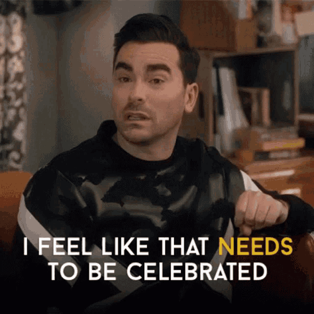

class: segue, left
background-image: url("img/CUni2.png")
background-size: 300px
background-position: 95% 5%

<br/>
<br/><br/><br/><br/><br/><br/>
.title1[Data Science in Healthcare]<br/>
.title2[Dr Romit Samanta] <br/>
.title3[NIHR Academic Clinical Lecturer in ICM <br/>
Heart & Lung Research Institute, University of Cambridge <br/> 
Royal Papworth & Addenbrooke's Hospital <br/>
<br/>
East of England Anaesthetics Trainee Forum `r Sys.Date()`]


```{r setup, include=FALSE}
options(htmltools.dir.version = FALSE)

```

```{css echo=FALSE}
.highlight-last-item > ul > li, 
.highlight-last-item > ol > li {
  opacity: 0.5;
}
.highlight-last-item > ul > li:last-of-type,
.highlight-last-item > ol > li:last-of-type {
  opacity: 1;
}

.show-only-last-code-result pre + pre:not(:last-of-type) code[class="remark-code"] {
    display: none;
  
.right-column2{
  width: 70%;
  float: right;
  padding-top: 1em;
  padding-left: 0.5em;
}

```

---

# Declarations

Clinical lectureship funded by the National Institute for Healthcare Research (NIHR)

PhD funded by:
- Medical Research Council
- NIHR
- Glaxosmithkline plc
- Cambrdige Biomedical Research Center

No conflicts of interest

All the software I use is open source and free.

---

class: highlight-last-item

# We have lots to talk about

- How I got into this mess

--

- What is Data Science?

--

- Why is this new?

--

- How can I jump on this bandwagon?

--

<br/>
<br/>
<br/>

.red[I am not going to talk about:]


- Statistics


- Machine learning


- Artifical intelligence


- Google chatbots that think they might be alive

---

# Anyone can do this

.left-column[
**2005**
<br/><br/>
**2005 - 13**
<br/><br/>
**2013**
<br/><br/>
*2015*<br/><br/>
**2016 - 17**<br/><br/>
**2018 - 21**<br/><br/>
**2021**
]

.right-column2[<br/>
Cambridge & Imperial
<br/><br/>
 FY, Core medicine, Sydney (ICU, 1 yr), Core anaesthetics
<br/><br/>
 St3 Anaesthetics East of England, FRCA
<br/><br/>
 *SMART course*
<br/><br/>
 University Division of Anaesthesia (UDA) post
<br/><br/>
 PhD  [ Thesis: *Endotype Discovery in ARDS* ]
<br/><br/>
 NIHR Academic Clinical Lecturer in ICM
<br/><br/>
{{content}}
]

--

*Not an ACF*
<br/>
<br/>
*No academic credentials before embarking on the UDA post*
{{content}}


---


.center[ ]


---


.center[ ]


---


.center[ ]


---

# The well-rehearsed path

--

.center[ ]


---


# So what has changed?

--

Data availability

--

Accessibility of methods


--

The need for a narrative that:

--
 
 - Changes behaviour

--

 - Influences policy


---

class: highlight-last-item

# Why can't I just use Excel?

.pull-left[
Data size limitations


Statistical methods


Customised, high quality outputs


Version control 


Reproducible workflows


Talk to other computer languages


Grinds to a halt
]


.pull-right[

 .right[ 

*The Guardian, 6th October 2020*

] ]

---


# R alternatives

1 Python 


2 Julia


3 Matlab (££)


4 STATA (stats only) (££)


---

class: 
# You are not committing to this journey

<center>
```{r echo = FALSE}
library(DiagrammeR)

grViz("digraph flowchart  {
      graph[layout = dot, rankdir = LR]
      # node definitions with substituted label text
      node [fontname = Courier, shape = oval, style = filled, fillcolor = Linen, width=3.4, height = 2.5, fixedsize = false, fontsize = 45]        
      tab1 [label = '@@1']
      tab2 [label = '@@2']
      tab3 [label = '@@3']
      tab4 [label = '@@4']
      node [fontname = Courier, shape = rectangle, style = filled, fillcolor = white, fontsize = 45,
      style = dashed, fontcolor = darkslategray, width = 3, height = 3 fixedsize = false]        
      tab5 [label = '@@5']
      tab6 [label = '@@6']
      tab7 [label = '@@7']
      
      # edge definitions with the node IDs
      tab1 -> tab2 ->tab3 -> tab4 [minlen=2.5, penwidth = 5, color = grey2]
      tab1 -> tab5  [style=invis, minlen=2.5]
      tab2 -> tab6  [style=invis, minlen=2.5]
      tab3 -> tab7  [style=invis, minlen=2.5]
      }

      [1]: 'Naive'
      [2]: 'Familiar'
      [3]: 'Proficient'
      [4]: 'Developer'
      [5]: 'Audits \\n QI \\n Papers'
      [6]: 'Statistics \\n New ad-hoc\\n methods'
      [7]: 'New packages / \\n methods for\\n publication \\n Software engineer'
      ")
```
<br/><br/>
</center>
---

class: inverse, middle, center

# FINE, but I just want to give an ANAESTHETIC!

---

# Data changes behaviour and practice

--


- RCoA: NAP 


--

- NELA

--

- National Hip Fracture Database


.center[]


---

# Data changes behaviour and practice

- Oxygen saturation measurement discrepancies between different races


.center[]

---


## The data science circle of life

.center[]

<br/>
--

`R` is particularly adept at **exploratory data analysis** 

--

This involves rapid iterations of the above cycle, which is facilitated by easy to read code and high quality plots.

--

As a doctor you have .red[domain] knowledge which means you understand how the data is collected and why things are recorded the way that they are in electronic health care records. 


---
# ggplot2: A grammar of graphics

`ggplot2` is a .red[package] for `R` which can help to create plots for data in a variety of different ways that can be iteratively improved to help convey the message. 

--

It makes exploration of data very easy and systematic

--
.pull-left[

```{R echo=T, eval=FALSE, include=T}
library(ggplot2)

ggplot(data = iris, 
       aes( x = Species, 
          y = Sepal.Length, 
          colour = Species) ) +
       geom_boxplot() + 
       geom_jitter() + 
       theme_bw()
```
]

.pull-right[
```{R echo=F, out.height=290, fig.retina = 3 }
library(ggplot2)

ggplot( data = iris, 
       aes( x = Species, 
          y = Sepal.Length,
          colour = Species) ) +
       geom_boxplot( ) + 
       geom_jitter( ) + 
  theme_bw( )
```
]

---

class: inverse, center, middle

.center[]

---
class: highlight-last-item

#Why I use `R`

One of the main advantages of `R`, for beginner programmers, is that objects and concepts are generally consistent across most packages. 
--

.pull-left[
<br/>
<br/>
- Lists
<br/><br/>
- Models
<br/><br/>
- Functions
]

--

.pull-right[

```{r eval = TRUE, out.width='450px', echo = FALSE}
knitr::include_graphics("img/mistype.jpg")
```
]


---
class: inverse, center, middle

## Data science offers the opportunity to address questions that previously, might only have been answered by specialised, established researchers.


---

class: inverse, center, middle

.center[]


---
class: inverse, center, middle

.center[]

---

class: center, middle, inverse

.center[]

---

class: center, middle, inverse

.center[]

---

class: center, middle, inverse

.center[]

---

class: center, middle, inverse

.center[]

---

class: inverse, center, middle


`r icons::simple_icons("twitter")`  `#TidyTuesday` [week of 05 July 2022](https://twitter.com/geokaramanis/status/1543270993455710210?s=20&t=-uOXAlTg8lXTLMS7pcKLzw)

---

class: center, middle, inverse

.center[]

---


class: center, middle, inverse

## It is probably no longer acceptable to say:

### *"Let's try this, it will probably not do any harm"*


---

background-image: url(img/where_to.png)
background-size: cover

# Where to go next


Find a question or a problem that interests you

--

Is this data available somewhere?

--

[eICU, MIMIC 3/4, UAmDb, Kaggle.com]

--

Clean / organise by learning a language

--

A support community

- real people, NHS-R, StackOverflow 

- Twitter

--

**Enjoy the experience!**

---

# How deep does this rabbit hole go?

--

- Cambridge center for AI in healthcare

- Big Data institute, University of Oxford

- UCL Institute for Health Informatics

--

- HDR UK

.center[]


---
class: inverse, center, middle



---

# My rabbit hole:

.center[]

---

# What do I get out of it?

--

Problem solving

--

Using a different part of my brain

--

Genuine "Eureka!" moments

--

Collaboration

--

Contributing to some of the most important questions in my field

--

Less exhausted by clinical workload

--

How can I make changes? What is the narrative that will support change and what data do I need to provide?

---

class: inverse, center, middle


---

background-image: url(img/rabbit-hole.png)
background-size: cover
class: inverse

# So in Summary 

--

Data is .red[not] the new gold

--

It is more accessible than experimental research <br/>(which it does not replace)

--

Data science is not a life-sentence

--

Explore for yourself how far you can <br/> go down the rabbit hole...

---

class: inverse, center, middle, bg_xari
<br/>
<br/>
<br/>
<br/>
<br/>
# Thank you for listening!
<br/>
<br/>
<br/>
`r icons::simple_icons("minutemailer")` rs307@cam.ac.uk

`r icons::simple_icons("twitter")` @dr_romster

`r icons::simple_icons("github")` dr-romster


Slides created via the R package [**xaringan**](https://github.com/yihui/xaringan).

The chakra comes from [remark.js](https://remarkjs.com), [**knitr**](https://yihui.org/knitr/), and [R Markdown](https://rmarkdown.rstudio.com).


