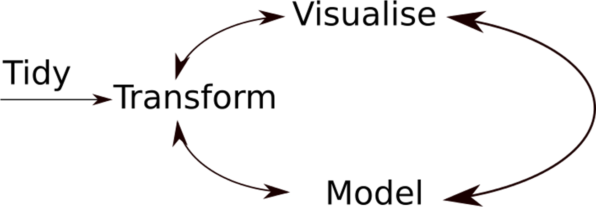

class: segue, left
background-image: url("img/CUni2.png")
background-size: 300px
background-position: 95% 5%

<br/>
<br/><br/><br/><br/><br/><br/>
.title1[SMART-R]<br/>
.title2[Dr Romit Samanta] <br/>
.title3[NIHR Clinical Lecturer in ICM <br/>
Heart and Lung Research Institute & Addenbrooke's Hospital <br>
<br>
SMART Course `r Sys.Date()`]


```{r setup, include=FALSE}
options(htmltools.dir.version = FALSE)

```

```{css echo=FALSE}
.highlight-last-item > ul > li, 
.highlight-last-item > ol > li {
  opacity: 0.5;
}
.highlight-last-item > ul > li:last-of-type,
.highlight-last-item > ol > li:last-of-type {
  opacity: 1;
}

.show-only-last-code-result pre + pre:not(:last-of-type) code[class="remark-code"] {
    display: none;
  
.right-column2{
  width: 70%;
  float: right;
  padding-top: 1em;
  padding-left: 0.5em;
}

```


---
background-image: url("img/HLRI.jpg")
background-size: 400px
background-position: 95% 90%

# Declarations

Clinical lectureship funded by the National Institute for Healthcare Research (NIHR)

PhD funded by:
- Medical Research Council
- NIHR
- Glaxosmithkline plc
- Cambridge Biomedical Research Center

No conflicts of interest

All the software I use is open source and free.

---

class: highlight-last-item

# We have lots to talk about

- The basics of `R`

--

- Data frames, functions, plotting

--

- Using `R` for *your* projects

--

- Data science principles


---
# Anyone can do this

.left-column[
**2005**
<br/><br/>
**2005 - 13**
<br/><br/>
**2013**
<br/><br/>
*2015*<br/><br/>
**2016 - 17**<br/><br/>
**2018 - 21**<br/><br/>
**2021**
]

.right-column2[<br/>
Cambridge & Imperial
<br/><br/>
 FY, Core medicine, Sydney (ICU, 1 yr), Core anaesthetics
<br/><br/>
 St3 Anaesthetics East of England, FRCA
<br/><br/>
 *SMART course*
<br/><br/>
 University Division of Anaesthesia (UDA) post
<br/><br/>
 PhD  [ Thesis: *Endotype Discovery in ARDS* ]
<br/><br/>
 NIHR Academic Clinical Lecturer in ICM
<br/><br/>
{{content}}
]

--

*Never an ACF*
<br/>
<br/>
*No academic credentials before embarking on the UDA post*
{{content}}
---


.center[ ]


---


.center[ ]


---


.center[ ]


---

# The well-rehearsed path

--

.center[ ]


---


# So what has changed?

--

Data availability

Accessibility of methods

--

The need for a narrative that:

 
 - Changes behaviour

 - Influences policy


---

class: highlight-last-item

# Why can't I just use Excel?

.pull-left[
Data size limitations


Statistical methods


Customised, high quality outputs


Version control 


.bolder[Reproducible workflows]


Talks to other computer languages
]


.pull-right[

 .right[ 

*The Guardian, 6th October 2020*

] ]

---


# R alternatives

Python 


Julia 


Matlab (£)


Graphpad Prism (£)


STATA (£)


---

class: 
# You are not committing to this journey

<center>
```{r echo = FALSE}
library(DiagrammeR)

grViz("digraph flowchart  {
      graph[layout = dot, rankdir = LR]
      # node definitions with substituted label text
      node [fontname = Courier, shape = oval, style = filled, fillcolor = Linen, width=3.4, height = 2.5, fixedsize = false, fontsize = 45]        
      tab1 [label = '@@1']
      tab2 [label = '@@2']
      tab3 [label = '@@3']
      tab4 [label = '@@4']
      node [fontname = Courier, shape = rectangle, style = filled, fillcolor = white, fontsize = 45,
      style = dashed, fontcolor = darkslategray, width = 3, height = 3 fixedsize = false]        
      tab5 [label = '@@5']
      tab6 [label = '@@6']
      tab7 [label = '@@7']
      
      # edge definitions with the node IDs
      tab1 -> tab2 ->tab3 -> tab4 [minlen=2.5, penwidth = 5, color = grey2]
      tab1 -> tab5  [style=invis, minlen=2.5]
      tab2 -> tab6  [style=invis, minlen=2.5]
      tab3 -> tab7  [style=invis, minlen=2.5]
      }

      [1]: 'Naive'
      [2]: 'Familiar'
      [3]: 'Proficient'
      [4]: 'Developer'
      [5]: 'Audits \\n QI \\n Papers'
      [6]: 'Statistics \\n New ad-hoc\\n methods'
      [7]: 'New packages / \\n methods for\\n publication \\n Software engineer'
      ")
```
<br/><br/>
</center>
---


class: inverse, middle, center

# FINE, but I just want to give an anaesthetic!

---

# Data changes behaviour and practice

--


- RCoA: NAP 


--

- NELA


- National Hip Fracture Database


.center[]


---

# Data changes behaviour and practice

Oxygen saturation measurement discrepancies between different skin tones. 


.center[]

---


class: inverse, middle, center

.center[]

---

class: inverse, middle, center
background-image: url(img/baseR.png)
background-size: 80%

---


# UndeR the Hood

<center>

```{r echo=FALSE}

library(DiagrammeR)
grViz("digraph flowchart  {
      # node definitions with substituted label text
      node [fontname = Courier, shape = oval, color = cornflowerblue]        
      tab1 [label = '@@1']
      tab6 [label = '@@6']
      tab7 [label = '@@7']
  
      node [fontname = Courier, shape = egg, fillcolor = Dodgerblue, style = filled, fontcolor = MidnightBlue]
      tab3 [label = '@@3']
      
      node [fontname = Helvetica, shape = egg, fillcolor = Darkslategray, style = filled, fontcolor = white]
      tab2 [label = '@@2']
      
      node [fontname = Helvetica, shape = square, fillcolor = DarkSeaGreen, style = filled, fontcolor = DimGray]
      tab5 [label = '@@5']
      
      node [fontname = Helvetica, shape = diamond, fillcolor = Gold, style = filled, fontcolor =red ]
      tab4 [label = '@@4']
      
      # edge definitions with the node IDs
      tab1 -> tab3 ->tab6 -> tab7;
      tab2 -> tab3;
      tab4 -> tab2;
      tab3 -> tab4;
      tab5 -> tab3;
      tab5 -> tab2;
      tab7 -> tab6 -> tab3;
      }

      [1]: '3rd Party App (packages)'
      [2]: 'R-Studio'
      [3]: 'R'
      [4]: 'Output'
      [5]: 'User Input'
      [6]: 'S3/S4/C'
      [7]: 'Machine code'
      ")

```

</center>
---

class: inverse, middle, center

## https://rstudio.cloud/content/4956373

## https://shorturl.at/abmO8


---

background-image: url(img/RstudioGUI.png)
background-size: 95%
class: inverse

.pull-left[
<br/>
<br/>
## Editor
<br/>
<br/>
<br/>
<br/>
<br/>
<br/>
<br/>
<br/>
<br/>
<br/>
<br/>
## Console
]
.pull-right[
<br/>
## <nbsp/>Environment
<br/>
<br/>
<br/>
<br/>
<br/>
<br/>
<br/>
<br/>
<br/>
## Output
]


---
class: inverse, middle, center

.center[ ]

---

class: inverse, middle, center

# The Basics

---

# Getting Started

To start a new script in the .bolder[Editor] window press this button and select *R Script* <br/>
<br/>

--

We write our code in script windows and send them to the **Console** by highlighting our code and using this button <br/> <br/> Or we can press Ctrl + Enter (&#8984; + Enter on Mac)
<br/>

--

*NB Enter just adds new lines to the script editor, but in the console it will run what you have entered *

Errors show up as .red[red text] in the **Console**

---

class: show-only-last-code-result

# Setting off...


.left-column[

Mathematical operations

]

--


.right-column[
```{r}
1+2
```
{{content}}

]
--
The other operators are **+   -   &#42;   /** 

```{r}
10-3
```
{{content}}
--

```{r}
2*3
```
{{content}}
--

```{r}
4/5
```

{{content}}

---

class: show-only-last-code-result

# What happened to your results?

.left-column[
Variables and assignment

]

--

.right-column[ 
To store values we need to **assign** our results or data to a **variable**

{{content}}
]

--

We do **assignment** with either `<-` or `=`
{{content}}
--

```{r} 
a <- 1
```
{{content}}
--

Asking the computer to re*call* this variable will return the stored information

```{r}
a
```
{{content}}
--
We can store different types of data in a variable

```{r}
day <- "Monday"
day
```
{{content}}

---

# Variable conventions

.left-column[

Naming variables
]

.footnote[ `==` means *equivalence* and returns either `TRUE` or `FALSE` based on a comparison of the left and right sides]

--

.right-column[

Use any text but you cant use spaces or a number of special characters:

      ^*%$@#!|/~()[]{}\
{{content}}
]
--
Variable names are case sensitive

```{r echo = T}
a <- 1
A <- 2
a == A
```

{{content}}
--

You can use `_` or `.` in variable names to make them easier to read: <br/> <br/>
`magic_number <- 7`

{{content}}

---

# Variable types

.left-column[
Strings
]

--
.right-column[
This is computer jargon for text as when you type normal words into the R console it will  refer look for functions or variables by that name.
{{content}}
]
--

We tell the computer that we are inputting text by wrapping quotation marks around our text. We can use either `" "` or `' '`, as long they are paired.

{{content}}

--

```{r}
text_variable <- "A single element of text, even though it contains many words"
```
{{content}}

--

```{r}
text_variable
```
---

# Variable types

.left-column[
Concatenation
]

--

.right-column[

If we want a variable to have multiple elements then we have to join the elements 
together. This is called **concatenation** (or combining) and we do this by using
the `c()` command.
{{content}}
]

--

Each element is seperated by a comma

```
some_numbers <- c(1,2,3,4)

weekend <- c("Saturday", "Sunday")
```
{{content}}
--

If we mix data types, `R` converts everything to strings
```{r}
mixed_data <- c(1, 2, " 3", 4)
```

{{content}}

--

```{r}
mixed_data
```

{{content}}


---

# R notation

.left-column[
Logical
.right[`!` <br/>
`==` <br/>
`&` <br/>
`|` <br/>
`>` <br/>
`<`<br/>
`>=`<br/>
]
<br/>
<br/>
<br/>
<br/>
<br/>
Missing Data
.right[`NA`<br/>
`NULL/NaN`<br/>
]
]
--

.right-column[<br/>
Not (the opposite of) <br/>
Is equivalent / identical to <br/>
Logical AND
<br/>
Logical OR
<br/>
Greater than
<br/>
Less than
<br/>
Greater than or equal to

{{content}}
]
--
```{r}
a <- 1
b <- 2
b >= a
```
{{content}}
--
<br/>
missing <br/>
not a number/not defined (e.g. divide by 0)
{{content}}

---

class: inverse, center, middle

.center[]

---

class: inverse, center, middle

#Exercise 1
---

## In R-Studio cloud

.left-column[
Open the `basicR.R` script 
<br/><br/>
Create a <br/>variable
<br/>
<br/>
Create another variable
<br/>
<br/>
Divide your numerical variable by 2
<br/>
<br/>
Add your name to your string variable
<br/>
<br/>
Add a 5th number to your numerical variable
]
--

.right-column2[
<br/><br/>
using the **Files** sub-tab in the **Outputs** window
{{content}}
]
<br/><br/>

--

<br/>
containing the strings: John, Paul, Ringo, George

{{content}}

--
<br/>
consisting of the numbers: 200, 515, 180, 160

{{content}}

--

<br/>
<br/>
store these new values as a new variable
{{content}}

--
<br/>
<br/>
<br/>
<br/>
use `c()` to update and store your name variable
{{content}}

--

<br/>
<br/>
update and store your numerical variable

`r countdown::countdown(minutes = 4, warn_when=60)`
{{content}}
---

class: inverse, center, middle


---


# Data frames

--

In healthcare we primarily deal with tabular data

--

This should be organised in a .red[tidy] format with variable names as column headers and samples in rows


```{r echo = FALSE}
set.seed(1234)
df_ex <- knitr::kable(head(data.frame("Patient ID"= seq(1:10),
                        "Hb" = round(rnorm(10, 10, 2),1),
                        "SBP" = round(rnorm(10, 110, 30),0),
                        "WCC" = round(rnorm(10, 8, 3),1),
                        "Diabetes" = rbinom(10, 1, 0.5),
                        "CCF" = rbinom(10, 1, 0.2)),8) , 
             format = 'html' )
df_ex
```


---
class: highlight-last-item

# Data frames

In R data frames can hold different types of data, with each column equivalent to its own variable.

--

We can populate the data frame with raw data from an imported file (e.g. a CSV, Excel file), 
or using values already assigned to a variable.

---

class: highlight-last-item

# Data frames
We use the function called `data.frame()` to do this. 

Each column is given a name and assigned values from a variable.
--


```{r}
some_numbers <- c(2,3,4)
some_letters <- c("a", "b", "c")

df <- data.frame( numbers = some_numbers,
                  letters = some_letters )
df
```

---

# Data frames

We can access different components of the data frame using special operators
--

To extract a named column we can use `$` operator with the column name


```{R}
df$numbers
```

--

We can also extract values using square bracket indexing: `[rows, columns]`

```{r}
df[1, ]
```
--

```{r}
df[ , 2]
```

--

```{r}
df[1, 2]
```


---
class:show-only-last-code-result  

# Data frames

We can access the top 5 or bottom 5 rows by using the `head()` and `tail()` functions. 

```{r}
head(df)
```

--

The `summary()` function gives us a glimpse of a data frame and some statistics associated with each variable.

```{r}
summary(df)
```
--

The `str()` function gives us a glimpse of the structure, but without the stats. 
```{r}
str(df)
```
We can view this information in the **Environment** window.

---
class:show-only-last-code-result  

# Data frames

If we want to observe all the data at once (like in Excel), then we can use the `View()` command 

```{r eval = F, echo = T}
View(df)
```

---

# Anatomy of a function

If data frames are 'objects/nouns' in R, then functions are the verbs that manipulate them

.center[]
--

Functions can be built in, from packages or user-defined

```{r echo=FALSE, eval = F, include = F}

library(DiagrammeR)
suppressPackageStartupMessages(library(widgetframe))
DiagrammeR::mermaid("
graph TB
A(plot)-->B[verb]
C(x)-->D[object]
E(y)-->F[object]
G(xlab)-->H[argument]
")

``` 
---
# Anatomy of a function

.left-column[
nesting functions
<br/>
<br/>
<br/>
<br/>
<br/>
<br/>
<br/>
<br/>
<br/>
<br/>
<br/>
?function.name
]

.right-column[
Functions can be nested within each other, but you have to read them inside-out:

```{r echo = T, eval = F}
round(log10(x), 2)
```

This function take the log of *x*, before rounding the result to 2 decimal points. 

Be sure to have the correct number of **.red[)]** s

<br/>
Provides the help documentation for the given function
{{content}}
]

--

At the end of the documentation there are usually examples
{{content}}
--

If you are still stuck then Google / Stack Overflow are your friends
{{content}}

---

class: inverse, middle, center

# Exercise 2

---

.left-column[
Create a data frame
<br/>
<br/>
<br/><br/>
Extract data from a data frame
<br/><br/>
<br/><br/>
<br/><br/>
<br/>
Assign new data to a specified location in a data frame
]

.right-column[Create a data frame using the two variables (one with character strings, the other containing some numbers) into a data frame 
{{content}}
]

--
<br/><br/><br/><br/>
Call the first row of the data frame
{{content}}

--

<br/>
Call the second column of the data frame
{{content}}

--

<br/>
Call the third value in the first column of the data frame
{{content}}

--

<br/><br/>
Change the value at this location to 2021
`r countdown::countdown(minutes = 5, warn_when=60)`

{{content}}

---

class: inverse, middle, center

.center[]

---

background-image: url(img/brb.gif)
background-size: contain
class: inverse

---

## The data science circle of life

.center[]

<br/>
--

`R` is particularly adept at **exploratory data analysis** 

--

This involves rapid iterations of the above cycle, which is facilitated by easy to read code and high quality plots.

--

The goal of data science work is to tell a story and easy to interpret visualisation of the data is a good way to achieve this. 


---
# ggplot2: A grammar of graphics

`ggplot2` is a **package** for `R` which takes a data frame and first defines the 
plotting parameters before it draws anything

These parameters are referred to as **aesthetics**

--

Different plots are then added, using the given aesthetics

These are referred to as **geometries**

--
.pull-left[

```{R echo=T, eval=FALSE, include=T}
library(ggplot2)

ggplot(data = iris, 
       aes( x = Species, 
          y = Sepal.Length, 
          colour = Species) ) +
       geom_boxplot() + 
       geom_jitter() + 
       theme_bw()
```
]

.pull-right[
```{R echo=F, out.height=290, fig.retina = 3 }
library(ggplot2)

ggplot( data = iris, 
       aes( x = Species, 
          y = Sepal.Length,
          colour = Species) ) +
       geom_boxplot( ) + 
       geom_jitter( ) + 
  theme_bw( )
```
]
---
class: inverse, center, middle

.center[]

---
class: center, middle, inverse

.center[]

---

class: center, middle, inverse

.center[]

---

# The `medicaldata` package

This is package that contains some curated medical data which we can use to practice with

--

Load the laryngoscopy data and inspect the data frame

```{r echo= T, eval = F}
library(medicaldata)
larynx_df <- laryngoscope
head(larynx_df)
str(larynx_df)
summary(larynx_df)
```


Use `?laryngoscope` to read the documentation and better appreciate the contents of this data frame.

---

# The `medicaldata` package

####How many female patients are there?

####How many patients have an ASA score of 3?

--

**.red[Tip 1:]** You can use a function called `which()` to find values in a vector that satisfy a logical condition


**.red[Tip 2:]** The `table()` function will generate a table from unique values in a vector

**.red[Tip 3:]** There is a `count()` function in the `dplyr` package

`r countdown::countdown(minutes = 4)`


---
#Recap

####You now understand the following terms
.right-column[ Variable <br/><br/>
String <br/><br/>
Data frame<br/><br/>
Concatenate<br/><br/>
Function<br/><br/>
]

---
#Recap

####You can
.right-column[
  Assign variables<br/><br/>
  Manipulate the values in a varible using functions and operations<br/><br/>

  Access values contained in data frames<br/><br/>
  Quickly obtain insights into the structure and nature of values in a data frame
]

---

## Importing and exporting data

We usually import delimited files into `R`: CSV, tab delimited

--

The `read.csv()` and `read.delim()` commands do this

```{r echo=T, eval=F}
new_df <- read.csv("path/to/file.csv",
                   header = TRUE)
```

--

Excel files can also be read and imported, using the `readxl` package

--

Data frames can be stored as `.csv` files using the `write.csv()` commands, or as `.Rdata` objects.

`.Rdata` object can also contain variables and models.


---

## Outputs 

Plots can be saved in a number of formats

.purple[.png] and .purple[.pdf] are good for cross-platform sharing

Some journals request high resolution .purple[.tiff] files


---
#The next step: Rmarkdown

This is a combination of `R` code and text that can be used to generate:

- reports

- papers

- presentations  (like these slides)

- dashboards

--

Code can be run in chunks, which helps to breakdown your workflow, reduce cognitive overload and steadily build a narrative.


---
class: highlight-last-item
#Finally

One of the main advantages of `R`, for beginner programmers, is that objects and concepts are generally consistent across most packages. 
--

.pull-left[
<br/>
<br/>
- Lists
<br/><br/>
- Models
<br/><br/>
- Functions
]

--

.pull-right[

```{r eval = TRUE, out.width='450px', echo = FALSE}

```
]
---
background-image: url(img/where_to.png)
background-size: cover

# Where to go next


Obtain **some data** 

--

**Clean** it and **plot** it using `R`

Write a report using `Rmarkdown` 

--

Do one or two online courses *(not essential)*

--

A **support community **

- real people, NHS-R, StackOverflow 

- Twitter `#TidyTuesday`


--

[**Enjoy the experience!**](https::/twitter.com)

---

class: inverse, center, middle


`r icons::simple_icons("twitter")`  `#TidyTuesday` [week of 25 October 2022](https://twitter.com/PauBaudry/status/1585932001500356608?s=20&t=6MaOVmZzbr7g2kLNocTzGw)

---
class: inverse, center, middle


---


# My rabbit hole:

.center[]

---

# What do I get out of it?

--

Problem solving


Using a different part of my brain


Genuine "Eureka!" moments


Collaboration


Contributing to some of the most important questions in my field

--

Less exhausted by clinical workload

--

How can I make changes? What is the narrative that will support change and what data and analysis do I need to provide to support this?

---


background-image: url(img/rabbit-hole.png)
background-size: cover
class: inverse

# In Summary 

--

Data is not the new gold


It is more accessible than experimental research <br/>(which it does not replace)

--

Data science is not a life-sentence


Explore for yourself how far you can <br/> go down the rabbit hole...


---
class: inverse, center, middle, bg_xari
<br/>
<br/>
<br/>
<br/>
<br/>
# Thank you!
<br/>
<br/>
<br/>
`r icons::simple_icons("minutemailer")` rs307@cam.ac.uk

`r icons::simple_icons("twitter")` @dr_romster

`r icons::simple_icons("github")` dr-romster


Slides created via the R package [**xaringan**](https://github.com/yihui/xaringan).

The chakra comes from [remark.js](https://remarkjs.com), [**knitr**](https://yihui.org/knitr/), and [R Markdown](https://rmarkdown.rstudio.com).


