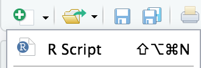

class: inverse, center, middle

# Health Warning

```{r setup, include=FALSE}
options(htmltools.dir.version = FALSE)

```

```{css echo=FALSE}
.highlight-last-item > ul > li, 
.highlight-last-item > ol > li {
  opacity: 0.5;
}
.highlight-last-item > ul > li:last-of-type,
.highlight-last-item > ol > li:last-of-type {
  opacity: 1;
}

.show-only-last-code-result pre + pre:not(:last-of-type) code[class="remark-code"] {
    display: none;
  
.right-column2{
  width: 70%;
  float: right;
  padding-top: 1em;
  padding-left: 0.5em;
}
```


---

class: highlight-last-item

# We have lots to talk about

- The basics of `R`

--

- Plotting, functions, data frames

--

- Using `R` for *your* projects

--

- Data science

---

class: highlight-last-item

# Why can't I just use Excel?

.pull-left[
Data size limitations


Statistical methods


Customised, high quality outputs


Version control 


**Reproducible workflows**


Talks to other computer languages
]


.pull-right[

 .right[ 

*The Guardian, 6th October 2020*

] ]

---


# R alternatives

1 Matlab 


2 STATA (stats only)


3 Python


4 Graphpad Prism


---
# Anyone can do this


**2005** Imperial & Cambridge

**2005 - 13** FY, Core medicine, Sydney (ICU, 1 yr), Core anaesthetics

**2013** St3 Anaesthetics East of England, FRCA

*2015 SMART course*

**2016 - 17** University division of Anaesthesia (UDA)

**2018 - 21** PhD (NIHR / MRC / GSK) [*Endotype Discovery in ARDS*]

**2021** NIHR Academic Clinincal Lecturer in ICM

<br/>
*Not an ACF*
<br/>
<br/>
*No academic credentials before embarking on the UDA post*

---

background-image: url(img/baseR.png)
background-size: 80%

---


# UndeR the Hood

<center>

```{r echo=FALSE}

library(DiagrammeR)
grViz("digraph flowchart  {
      # node definitions with substituted label text
      node [fontname = Courier, shape = oval, color = cornflowerblue]        
      tab1 [label = '@@1']
      tab6 [label = '@@6']
      tab7 [label = '@@7']
  
      node [fontname = Courier, shape = egg, fillcolor = Dodgerblue, style = filled, fontcolor = MidnightBlue]
      tab3 [label = '@@3']
      
      node [fontname = Helvetica, shape = egg, fillcolor = Darkslategray, style = filled, fontcolor = white]
      tab2 [label = '@@2']
      
      node [fontname = Helvetica, shape = square, fillcolor = DarkSeaGreen, style = filled, fontcolor = DimGray]
      tab5 [label = '@@5']
      
      node [fontname = Helvetica, shape = diamond, fillcolor = Gold, style = filled, fontcolor =red ]
      tab4 [label = '@@4']
      
      # edge definitions with the node IDs
      tab1 -> tab3 ->tab6 -> tab7;
      tab2 -> tab3;
      tab4 -> tab2;
      tab3 -> tab4;
      tab5 -> tab3;
      tab5 -> tab2;
      tab7 -> tab6 -> tab3;
      }

      [1]: '3rd Party App (packages)'
      [2]: 'R-Studio'
      [3]: 'R'
      [4]: 'Output'
      [5]: 'User Input'
      [6]: 'S3/S4/C'
      [7]: 'Machine code'
      ")

```

</center>
---

class: inverse, middle, center

## https://rstudio.cloud/project/750723

---

background-image: url(img/RstudioGUI.png)
background-size: 95%
class: inverse

.pull-left[
<br/>
<br/>
## Editor
<br/>
<br/>
<br/>
<br/>
<br/>
<br/>
<br/>
<br/>
<br/>
<br/>
<br/>
## Console
]
.pull-right[
<br/>
## <nbsp/>Envrionment
<br/>
<br/>
<br/>
<br/>
<br/>
<br/>
<br/>
<br/>
<br/>
## Output
]


---
class: inverse, middle, center

.center[ ]

---

class: inverse, middle, center

# The Basics

---

# Getting Started

To start a new script in the **Editor** window press this button and select *R Script* <br/>
<br/>

We write our code in script windows and send them to the **Console** by highlighting our code and using this button <br/> <br/> Or we can press Ctrl + Enter (&#8984; + Enter on Mac)
<br/>

*NB Enter just adds new lines to the script editor, but in the console it will run what you have entered *

Errors show up as .red[red text] in the **Console**

---

class: show-only-last-code-result

# Setting off...


.left-column[

Mathematical operations

]

--


.right-column[
```{r}
1+2
```
{{content}}

]
--
The other operators are **+   -   &#42;   /** 

```{r}
10-3
```
{{content}}
--

```{r}
2*3
```
{{content}}
--

```{r}
4/5
```

{{content}}

---

class: show-only-last-code-result

# What happened to your results?

.left-column[
Variables and assignment

]

--

.right-column[ 
To store values we need to **assign** our results or data to a **variable**

{{content}}
]

--

We do **assignment** with either `<-` or `=`
{{content}}
--

```{r} 
a <- 1
```
{{content}}
--

Asking the computer to re*call* this variable will return the stored information

```{r}
a
```
{{content}}
--
We can store different types of data in a variable

```{r}
day <- "Monday"
day
```
{{content}}

---

# Variable conventions

.left-column[

Naming variables
]

.footnote[ `==` means *equivalence* and returns either `TRUE` or `FALSE` based on a comparison of the left and right sides]

--

.right-column[

Use any text but you can't use spaces or a number of special characters:

      ^*%$@#!|/~()[]{}\
{{content}}
]
--
Variable names are case sensitive

```{r echo = T}
a <- 1
A <- 2
a == A
```

{{content}}
--

You can use `_` or `.` in variable names to make them easier to read: <br/> <br/>
`magic_number <- 7`

{{content}}

---

# Variable types

.left-column[
Strings
]
--
.right-column2[
This is computer jargon for text as when you type normal words into the R console it will  refer look for functions or variables by that name.
{{content}}
]
--

We tell the computer that we are inputting text by wrapping quotation marks around our text. We can use either `" "` or `' '`, as long they are paired.

{{content}}

--

```{r}
text_variable <- "A single element of text, even though it contains many words"
```
{{content}}

--

```{r}
text_variable
```
---

# Variable types

.left-column[
Concatenation
]

--

.right-column[

If we want a variable to have multiple elements then we have to join the elements 
together. This is called **concatenation** (or combining) and we do this by using
the `c()` command.
{{content}}
]

--

Each element is seperated by a comma

```
some_numbers <- c(1,2,3,4)

weekend <- c("Saturday", "Sunday")
```
{{content}}
--

If we mix data types, `R` converts everything to strings
```{r}
mixed_data <- c(1, 2, " 3", 4)
```

{{content}}

--

```{r}
mixed_data
```

{{content}}

---

# R notation

.left-column[
Logical
.right[`==` <br/>
`&` <br/>
`|` <br/>
`>` <br/>
`<`<br/>
`>=`<br/>
]
<br/>
<br/>
<br/>
<br/>
<br/>
Missing Data
.right[`NA`<br/>
`NULL`<br/>
]
]
--

.right-column[<br/>
Is equivalent / identical to <br/>
Logical AND
<br/>
Logical OR
<br/>
Greater than
<br/>
Less than
<br/>
Greater than or equal to

{{content}}
]
--
```{r}
a <- 1
b <- 2
b >= a
```
{{content}}
--
<br/>
missing <br/>
not a number (e.g. divide by 0 or try to take a log of a negative number)
{{content}}


---

class: inverse, center, middle

#Exercise 1
---

# Go to R-Studio Cloud

.left-column[
Open the `basicR.R` script 
<br/><br/>
Create a <br/>variable
<br/>
<br/>
Create another variable
<br/>
<br/>
Divide your numerical variable by 2
<br/>
<br/>
Add your name to your string variable
<br/>
<br/>
Add a 5th number to your numerical variable
]
--

.right-column2[
<br/><br/>
using the **Files** sub-tab in the **Outputs** window
{{content}}
]
<br/><br/>

--

<br/>
containing the strings: John, Paul, Ringo, George

{{content}}

--
<br/>
consisting of the numbers: 200, 515, 180, 160

{{content}}

--

<br/>
<br/>
store these new values as a new variable
{{content}}

--
<br/>
<br/>
<br/>
<br/>
use `c()` to update and store you name variable
{{content}}

--

<br/>
<br/>
update and store you numerical variable
{{content}}
---

class: inverse, center, middle


---


# Data frames

In healthcare we primarily deal with tabular data

--

This should be organised in a *tidy* format with variable names on top and samples along the sides

--

```{r echo = FALSE}
set.seed(1234)
df_ex <- knitr::kable(data.frame("Patient ID"= seq(1:10),
                        "Hb" = round(rnorm(10, 10, 2),1),
                        "SBP" = round(rnorm(10, 110, 30),0),
                        "WCC" = round(rnorm(10, 8, 3),1),
                        "Diabetes" = rbinom(10, 1, 0.5),
                        "CAD" = rbinom(10, 1, 0.2)), 
             format = 'html' )
df_ex
```


---
class: highlight-last-item

# Data Frames

In R data frames can hold different types of data, with each column equivalent to its own variable.

--

We can populate the data frame with raw data from an imported file (e.g. a CSV), 
or using values already assigned to a variable.

--

We use the function called `data.frame()` to do this. 

Each column is given a name and assigned values from a variable.
--


```{r}
some_numbers <- c(2,3,4)
some_letters <- c("a", "b", "c")

df <- data.frame( numbers = some_numbers,
                  letters = some_letters )
df
```

---

# Data frames

We can access different components of the data frame using special operators

To extract a named column we can use `$` operator with the column name

--

```{R}
df$numbers
```

--

We can also extract values using square bracket indexing: `[rows, columns]`

```{r}
df[1, ]
```
--

```{r}
df[ , 2]
```

--

```{r}
df[1, 2]
```


---
class:show-only-last-code-result  

# Data frames

We can access the top 5 or bottom 5 rows by using the `head()` and `tail()` functions. 

```{r}
head(df)
```

--

The `summary()` function gives us a glimpse of a data frame and some statistics associated with each variable.

```{r}
summary(df)
```
--

The `str()` function gives us a glimpse of the structure, but without the stats. 
```{r}
str(df)
```
We can view this information in the **Environment** window.

---

# Anatomy of a function

If data frame are the 'objects' in R, then functions are the verbs that manipulate them

.blue [plot]
---


# Some Tips

- The title slide is created automatically by **xaringan**, but it is just another remark.js slide added before your other slides.

    The title slide is set to `class: center, middle, inverse, title-slide` by default. You can change the classes applied to the title slide with the `titleSlideClass` option of `nature` (`title-slide` is always applied).

    ```yaml
    output:
      xaringan::moon_reader:
        nature:
          titleSlideClass: [top, left, inverse]
    ```
    
--

- If you'd like to create your own title slide, disable **xaringan**'s title slide with the `seal = FALSE` option of `moon_reader`.

    ```yaml
    output:
      xaringan::moon_reader:
        seal: false
    ```

---


---


---

# Some Tips

- To make slides work offline, you need to download a copy of remark.js in advance, because **xaringan** uses the online version by default (see the help page `?xaringan::moon_reader`).

- You can use `xaringan::summon_remark()` to download the latest or a specified version of remark.js. By default, it is downloaded to `libs/remark-latest.min.js`.

- Then change the `chakra` option in YAML to point to this file, e.g.

    ```yaml
    output:
      xaringan::moon_reader:
        chakra: libs/remark-latest.min.js
    ```

- If you used Google fonts in slides (the default theme uses _Yanone Kaffeesatz_, _Droid Serif_, and _Source Code Pro_), they won't work offline unless you download or install them locally. The Heroku app [google-webfonts-helper](https://google-webfonts-helper.herokuapp.com/fonts) can help you download fonts and generate the necessary CSS.

---

# Macros

- remark.js [allows users to define custom macros](https://github.com/yihui/xaringan/issues/80) (JS functions) that can be applied to Markdown text using the syntax `![:macroName arg1, arg2, ...]` or ``. For example, before remark.js initializes the slides, you can define a macro named `scale`:

    ```js
    remark.macros.scale = function (percentage) {
      var url = this;
      return '';
    };
    ```

    Then the Markdown text

    ```markdown
    
    ```

    will be translated to
    
    ```html
    
    ```

---

# Macros (continued)

- To insert macros in **xaringan** slides, you can use the option `beforeInit` under the option `nature`, e.g.,

    ```yaml
    output:
      xaringan::moon_reader:
        nature:
          beforeInit: "macros.js"
    ```

    You save your remark.js macros in the file `macros.js`.

- The `beforeInit` option can be used to insert arbitrary JS code before `remark.create()`. Inserting macros is just one of its possible applications.

---

# CSS

Among all options in `xaringan::moon_reader`, the most challenging but perhaps also the most rewarding one is `css`, because it allows you to customize the appearance of your slides using any CSS rules or hacks you know.

You can see the default CSS file [here](https://github.com/yihui/xaringan/blob/master/inst/rmarkdown/templates/xaringan/resources/default.css). You can completely replace it with your own CSS files, or define new rules to override the default. See the help page `?xaringan::moon_reader` for more information.

---

# CSS

For example, suppose you want to change the font for code from the default "Source Code Pro" to "Ubuntu Mono". You can create a CSS file named, say, `ubuntu-mono.css`:

```css
@import url(https://fonts.googleapis.com/css?family=Ubuntu+Mono:400,700,400italic);

.remark-code, .remark-inline-code { font-family: 'Ubuntu Mono'; }
```

Then set the `css` option in the YAML metadata:

```yaml
output:
  xaringan::moon_reader:
    css: ["default", "ubuntu-mono.css"]
```

Here I assume `ubuntu-mono.css` is under the same directory as your Rmd.

See [yihui/xaringan#83](https://github.com/yihui/xaringan/issues/83) for an example of using the [Fira Code](https://github.com/tonsky/FiraCode) font, which supports ligatures in program code.

---

# CSS (with Sass)

**xaringan** also supports Sass support via **rmarkdown**. Suppose you want to use the same color for different elements, e.g., first heading and bold text. You can create a `.scss` file, say `mytheme.scss`, using the [sass](https://sass-lang.com/) syntax with variables:

```scss
$mycolor: #ff0000; 
.remark-slide-content > h1 { color: $mycolor; }
.remark-slide-content strong { color: $mycolor; }
```

Then set the `css` option in the YAML metadata using this file placed under the same directory as your Rmd:

```yaml
output:
  xaringan::moon_reader:
    css: ["default", "mytheme.scss"]
```

This requires **rmarkdown** >= 2.8 and the [**sass**](https://rstudio.github.io/sass/) package. You can learn more about **rmarkdown** and **sass** support in [this blog post](https://blog.rstudio.com/2021/04/15/2021-spring-rmd-news/#sass-and-scss-support-for-html-based-output) and in [**sass** overview vignette](https://rstudio.github.io/sass/articles/sass.html).

---

# Themes

Don't want to learn CSS? Okay, you can use some user-contributed themes. A theme typically consists of two CSS files `foo.css` and `foo-fonts.css`, where `foo` is the theme name. Below are some existing themes:

```{r, R.options=list(width = 70)}
names(xaringan:::list_css())
```

---

# Themes

To use a theme, you can specify the `css` option as an array of CSS filenames (without the `.css` extensions), e.g.,

```yaml
output:
  xaringan::moon_reader:
    css: [default, metropolis, metropolis-fonts]
```

If you want to contribute a theme to **xaringan**, please read [this blog post](https://yihui.org/en/2017/10/xaringan-themes).

---
class: inverse, middle, center
background-image: url(https://upload.wikimedia.org/wikipedia/commons/3/39/Naruto_Shiki_Fujin.svg)
background-size: contain

# Naruto

---
background-image: url(https://upload.wikimedia.org/wikipedia/commons/b/be/Sharingan_triple.svg)
background-size: 100px
background-position: 90% 8%

# Sharingan

The R package name **xaringan** was derived<sup>1</sup> from **Sharingan**, a dōjutsu in the Japanese anime _Naruto_ with two abilities:

- the "Eye of Insight"

- the "Eye of Hypnotism"

I think a presentation is basically a way to communicate insights to the audience, and a great presentation may even "hypnotize" the audience.<sup>2,3</sup>

.footnote[
[1] In Chinese, the pronounciation of _X_ is _Sh_ /ʃ/ (as in _shrimp_). Now you should have a better idea of how to pronounce my last name _Xie_.

[2] By comparison, bad presentations only put the audience to sleep.

[3] Personally I find that setting background images for slides is a killer feature of remark.js. It is an effective way to bring visual impact into your presentations.
]

---

# Naruto terminology

The **xaringan** package borrowed a few terms from Naruto, such as

- [Sharingan](https://naruto.fandom.com/wiki/Sharingan) (写輪眼; the package name)

- The [moon reader](https://naruto.fandom.com/wiki/Moon_Reader) (月読; an attractive R Markdown output format)

- [Chakra](https://naruto.fandom.com/wiki/Chakra) (查克拉; the path to the remark.js library, which is the power to drive the presentation)

- [Nature transformation](https://naruto.fandom.com/wiki/Nature_Transformation) (性質変化; transform the chakra by setting different options)

- The [infinite moon reader](https://naruto.fandom.com/wiki/Infinite_Tsukuyomi) (無限月読; start a local web server to continuously serve your slides)

- The [summoning technique](https://naruto.fandom.com/wiki/Summoning_Technique) (download remark.js from the web)

You can click the links to know more about them if you want. The jutsu "Moon Reader" may seem a little evil, but that does not mean your slides are evil.

---

class: center

# Hand seals (印)

Press `h` or `?` to see the possible ninjutsu you can use in remark.js.


---

class: center, middle

# Thanks!

Slides created via the R package [**xaringan**](https://github.com/yihui/xaringan).

The chakra comes from [remark.js](https://remarkjs.com), [**knitr**](https://yihui.org/knitr/), and [R Markdown](https://rmarkdown.rstudio.com).

---
background-image: url(img/Sharingan_triple.svg)
background-size: 15%


class: center, bottom, inverse

# made with **xaringan**

